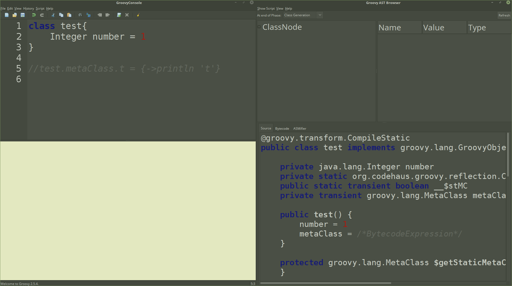
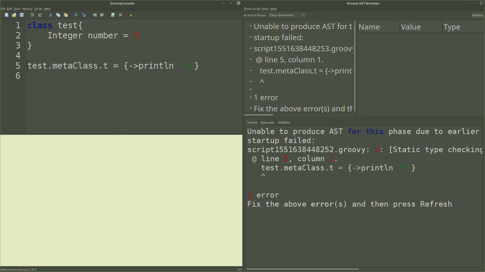

== Groovy Console
The Enterprise Groovy plugin will provide a Gradle task to bring up a Groovy Console, if the project doesn't already
provide one. This can be good for playing with Groovy code, and more importantly, using the AST Browser.
The AST browser, allows you to see, what the Groovy Compiler does to your code, making it less magical.

AS of the 1.0 release, the console doesn't have access to the full conventions configuration, because of limitations
between the Groovy Console, and the AST transform that drives Enterprise Groovy. For the Groovy Console it has
access to the following configurations:

* disable - Turning Enterprise Groovy on or off for the console.
* whiteListScripts - This is overridden to be false, because everything you do in the Groovy Console is a script with no target build directory.
* disableDynamicCompile - This will determine if you can use `@CompileDynamic` or `@CompileStatic(TypeCheckingMode.SKIP)`, in the console.
* defAllowed- This will determine if you can use `def` in the console.

